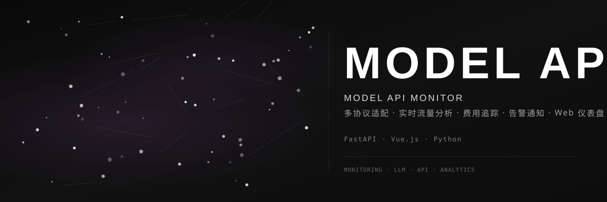

<div align="center">



<br>

### 📡 模型 API 监控工具

[](https://github.com/dirjaker/model-monitor/stargazers)
[](https://github.com/dirjaker/model-monitor/network/members)
[](https://github.com/dirjaker/model-monitor/graphs/contributors)
[](https://github.com/dirjaker/model-monitor/blob/dev/LICENSE)

</div>

---

## ✨ 功能特性

| 功能 | 描述 |
|------|------|
| 🔌 **代理模式** | 本地 HTTP 代理转发到 DeepSeek API，自动记录每次调用 | 
| 🔍 **嗅探模式** | 基于 mitmproxy 被动抓取 HTTPS 流量，无需修改客户端代码 |
| 📊 **Web 仪表盘** | FastAPI + Chart.js 可视化面板，支持 REST API 和实时推送 |
| 🪟 **桌面小组件** | PySide6 浮动监控面板，5 色主题，系统托盘常驻 |
| 🍎 **macOS 原生** | macOS 菜单栏集成与 tkinter 图形界面，支持 py2app 打包 |
| 💰 **费用追踪** | 精确统计每次调用的 Token 消耗和费用 |
| 🔔 **采集管理** | 仪表盘内一键启停 proxy/sniffer 采集进程 |
| 📈 **实时推送** | WebSocket + SSE 双通道，数据变动即时刷新 |

## 🚀 快速开始

```bash
# 克隆项目
git clone https://github.com/dirjaker/model-monitor.git
cd model-monitor

# 创建虚拟环境
conda create -n model-monitor python=3.12 -y
conda activate model-monitor

# 安装依赖
pip install -r requirements.txt

# 启动代理模式（采集数据）
python main.py proxy

# 新开终端，启动 Web 仪表盘
python main.py web
```

### 命令行用法

```bash
python main.py proxy          # HTTP 代理模式（采集）
python main.py sniffer        # mitmproxy 嗅探模式（采集）
python main.py web            # Web 仪表盘
python main.py desktop        # 桌面小组件（PySide6）
python main.py app            # macOS 原生图形界面
python main.py export -o data.json  # 导出数据为 JSON
python main.py config --show  # 查看配置
```

### 三种展示形式速览

| 形式 | 命令 | 端口 | 适用平台 |
|------|------|------|----------|
| 🌐 **Web 仪表盘** | `python main.py web` | 10004 | 所有平台（浏览器访问） |
| 🪟 **桌面小组件** | `python main.py desktop` | — | Linux / Windows / macOS |
| 🍎 **macOS 原生** | `python main.py app` | — | macOS 仅 |

## 🛠️ 技术栈

| 层级 | 技术 |
|------|------|
| **后端** | FastAPI, SQLAlchemy, uvicorn |
| **前端** | Chart.js, 原生 HTML/CSS |
| **代理** | httpx (异步 HTTP/2) |
| **嗅探** | mitmproxy |
| **数据库** | SQLite (WAL 模式) |
| **桌面** | PySide6 |
| **macOS** | rumps, tkinter, py2app |

## 📁 项目结构

```
model-monitor/
├── main.py                  # 统一入口
├── config.yaml              # 配置文件
├── requirements.txt         # 依赖清单
├── src/
│   ├── cli.py               # 命令行界面 (7 个子命令)
│   ├── config.py            # YAML 配置管理
│   ├── database.py          # SQLite 数据库 (WAL 模式)
│   ├── events.py            # 事件总线 (发布/订阅)
│   ├── proxy/
│   │   ├── server.py        # 异步 HTTP 代理服务器
│   │   └── adapters.py      # DeepSeek 适配器
│   ├── sniffer/
│   │   ├── mitm.py          # mitmproxy 嗅探插件
│   │   └── cert.py          # CA 证书管理
│   ├── web/
│   │   ├── app.py           # FastAPI 应用工厂
│   │   ├── api.py           # REST API + 采集管理 + 实时推送
│   │   └── static/
│   │       └── index.html   # Web 仪表盘 (Chart.js)
│   ├── widget/
│   │   └── __init__.py      # 桌面小组件 (PySide6)
│   └── macos/
│       ├── app.py           # macOS 原生 GUI (tkinter)
│       └── menu_bar.py      # macOS 菜单栏 (rumps)
├── assets/
│   └── banner.svg           # README 横幅
├── docs/
│   ├── architecture.md      # 系统架构文档
│   ├── user-guide.md        # 用户使用指南
│   ├── DEVELOPMENT.md       # 开发指南
│   └── CHANGELOG.md         # 更新日志
├── packaging/
│   └── py2app_setup.py      # macOS 打包脚本
├── tests/
│   ├── test_adapters.py
│   ├── test_config.py
│   ├── test_database.py
│   └── test_events.py
└── setup.py                 # Python 包配置
```

## 📖 文档索引

- [系统架构](docs/architecture.md) — 模块设计、数据流、技术选型
- [用户指南](docs/user-guide.md) — 三种展示形式的安装和使用教程
- [开发指南](docs/DEVELOPMENT.md) — 开发环境搭建、核心模式、扩展开发
- [更新日志](docs/CHANGELOG.md) — 版本历史

## 📄 许可证

[MIT License](LICENSE)

---

<div align="center">

🔗 **GitHub**: [dirjaker/model-monitor](https://github.com/dirjaker/model-monitor)

⭐ 如果这个项目对你有帮助，请给一个 Star 支持一下！

</div>
